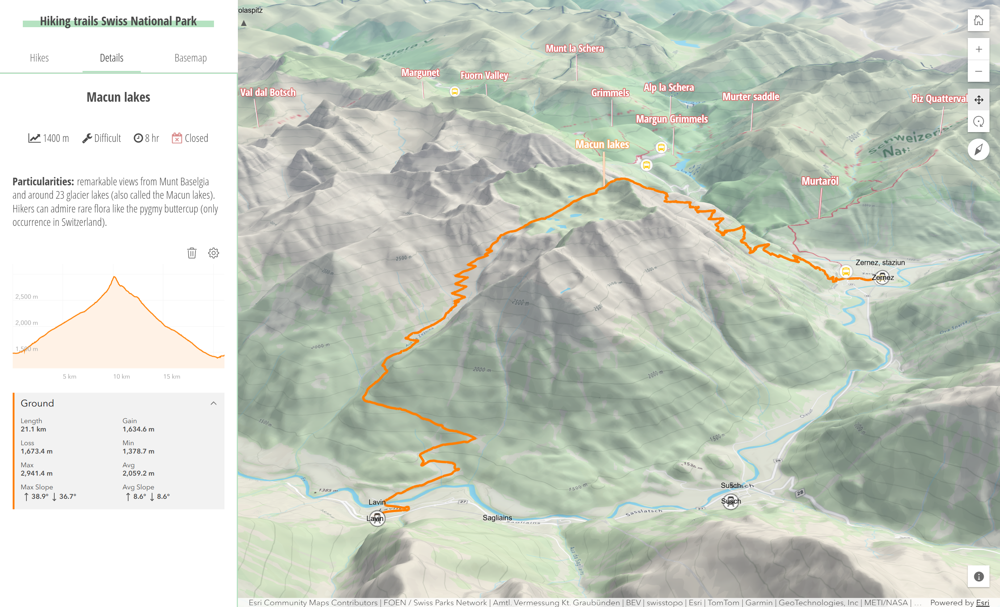

# Hiking trails Swiss National Park

This application displays the hiking trails in the [Swiss National Park](http://www.nationalpark.ch/en/). The Swiss National Park is the most highly preserved area in Switzerland and it is a beloved place to go hiking.

[View it live](https://esri.github.io/hiking-trails-app)

## Features

* Displaying hikes on a 3D map along with the altitude profile and descriptions. The altitude profile is automatically generated from the elevation service used in the map. 

* The hikes can be filtered by Difficulty, Category, Walktime and Ascent. These categories are used to describe the degree of difficulty of the trails, according to the [Swiss National Park description](http://www.nationalpark.ch/en/visit/trails-routes).

## Instructions

1. Fork and then clone the repo.
2. Install dependencies with `npm install`.
3. Update the [config](./src/ts/config.ts) file with your services/data.
4. Start the development app with `npm run start`.
5. The production app can be created with `npm run build`.

## Resources

The following libraries, APIs and datasets  were used to make this application:

* Hiking trails geometry and attributes data from the [Swiss National Park](http://www.nationalpark.ch/en/visit/trails-routes).
* [ArcGIS SDK for JavaScript](https://developers.arcgis.com/javascript/) for the map.
* [Font Awesome](https://fontawesome.com/) for icons in the details panel.

## Disclaimer

This demo application is for illustrative purposes only and it is not maintained. There is no support available for deployment or development of the application.

## Contributing

Esri welcomes contributions from anyone and everyone. Please see our [guidelines for contributing](https://github.com/esri/contributing).

## Licensing
Copyright 2026 Esri

Licensed under the Apache License, Version 2.0 (the "License");
you may not use this file except in compliance with the License.
You may obtain a copy of the License at

   http://www.apache.org/licenses/LICENSE-2.0

Unless required by applicable law or agreed to in writing, software
distributed under the License is distributed on an "AS IS" BASIS,
WITHOUT WARRANTIES OR CONDITIONS OF ANY KIND, either express or implied.
See the License for the specific language governing permissions and
limitations under the License.

A copy of the license is available in the repository's [license.txt](./license.txt ) file.
